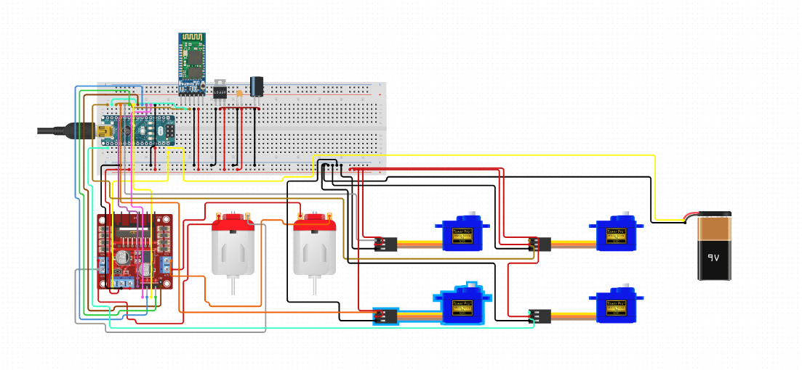

# Phone-Controlled Robot Arm

My phone-controlled robot arm is a robot arm on top of wheels. The robot arm and the motor wheels are controlled by a single Android app, and the robot arm and the motor wheels are controlled via Bluetooth. The robot arm is able to pick things up and the motors move the robot arm around. 


| **Engineer** | **School** | **Area of Interest** | **Grade** |
|:--:|:--:|:--:|:--:|
| Liz L | Monta Vista High School | Electrical Engineering | Incoming Sophomore

<!--- **Replace the BlueStamp logo below with an image of yourself and your completed project. Follow the guide [here](https://tomcam.github.io/least-github-pages/adding-images-github-pages-site.html) if you need help.**

 -->
  
# Final Milestone

<iframe width="560" height="315" src="https://www.youtube.com/embed/vlAkarspFro" title="YouTube video player" frameborder="0" allow="accelerometer; autoplay; clipboard-write; encrypted-media; gyroscope; picture-in-picture; web-share" allowfullscreen></iframe>

I have attached wheels and DC motors to my robot chassis. I've done this so that way my robot arm can move along the ground. My final milestone is the second-most difficult milestone, after the third milestone. I connected the motors to a battery of four AA batteries to make sure the motors had the same RPM, or else my robot car would not go straight. I taped many layers of duct tape onto the shaft of the motors and took a video from similar angles of each motor before combining the videos using video editing software to compare the rotating speeds of the motors. After I found the right pair of motors, I used double-sided tape to attach two DC motors to my robot chassis, then attached the wheels to the DC motor. I wired the motors to the motor driver in order to test the motors and check that all the pins on the motor drivers worked (forward and backward for each motor).

Obviously, my robot chassis can't balance on two wheels, so I found a swerve ball that I could place in the front of my robot chassis. However, there was a difference in the height of the swerving ball and the wheels of the motor. Therefore I designed a block on Onshape that extended an inch or two off from the robot chassis that had holes to place the motor driver and swerve wheel. Then I wired the motors to the motor driver and watched some Youtube videos on how to connect the motor driver to the Arduino Nano. My initial set-up was just the battery connecting to the motor driver, as well as four jumper wires from the four pins (that controlled the left and right motor forward and backward motion) to pins A2, A1, 10, 11. I then wrote the code for the robot arm. 

This did not work for three reasons. The first reason was my research was inaccurate. I had heard from someone that analog pins can be used as digital pins. This does not apply to Nanos, which was the Arduino I was using. I couldn't use pins A2 and A1, so I switched to pins 2 and 3 on the Cokoino shield. Also, I still had a separate battery plugged into the Nano. The circuits were separate and weren't communicating. I needed them to communicate. So I got rid of the battery for the Nano and wired a ground wire from the ground hole and a power wire from the 5V hole to the Nano. After running the code, my left motor was constantly running forward as soon as I ran it. After lots of checking, I realized I wrote my Bluetooth module as being connected to (2,1) for (RX, TX), but it was actually (0,1). So when I ran the code, the 2 pin was putting on high and causing the wheels to run. 

# Third Milestone 

<iframe width="560" height="315" src="https://www.youtube.com/embed/JkvX1tuo0gc" title="YouTube video player" frameborder="0" allow="accelerometer; autoplay; clipboard-write; encrypted-media; gyroscope; picture-in-picture; web-share" allowfullscreen></iframe>

My third milestone was making my robot arm able to be controlled through my phone. All I had to do was write the code for configuring my HC-05 (Bluetooth module) as the worker,  configure the Bluetooth module into the code, and make the app that controls the arm. Although these steps sound easy, the third milestone was the hardest milestone by a long shot. 

It took me a few days just to configure my HC-05 as the worker module. For some reason, the light for the HC-05 was not coming on no matter what wiring I tried. I made like three different resistor diagrams two or three times each (in case my soldering was incorrect). Nothing was working. Finally, after I got rid of the resistors and just wired everything normally (except for the VCC and EN pin, I wired soldered those two together) my HC-05 finally turned on. After that, I was able to configure it as the worker, and I used the same wiring setup in order to transmit information. I shouldn't have done that as this wiring was only for my HC-05 to remain in AT command mode, but even after scouring the internet there was literally no other way to turn my HC-05 on.

However, it was not receiving any information, so after a week of playing with the wiring and researching the HC-05, I was ready to give up. Eventually, I decided to just wire an HC-06 instead of an HC-5 to my Nano. I did this without any expectation for it because my HC-05 suddenly broke down and was no longer lighting up so I was pleasantly surprised when I was able to transmit information with the HC-06. Making the app and configuring the Bluetooth module into the code was extremely easy (I only struggled with it because I originally thought there was something wrong with my code/app instead of the HC-05). I made four sliders that sent information in the form of "s170" for example. "s1" meant that the slider that corresponded to Servo 1 was moved, and "70" was the intended angle for Servo 1. My next milestone/ my modification will be attaching wheels to my robot arm. 


# Second Milestone

<iframe width="560" height="315" src="https://www.youtube.com/embed/KjaYvXZ5siI" title="YouTube video player" frameborder="0" allow="accelerometer; autoplay; clipboard-write; encrypted-media; gyroscope; picture-in-picture; web-share" allowfullscreen></iframe>

 My second milestone was wiring up my controller to the robot arm. My controller consists  of a piece of acrylic and two joystick modules. The joystick modules are made of two potentiometers at a 90-degree angle. The two potentiometers are connected by a short spring.  The joysticks can move along the axes x, y, and z, although the z-axis will not be used as the robot only needs the axes x and y. The joystick outputs 2.5 volts while it is at its resting position. However, as the joystick is moved along the x and y axis, it outputs anywhere from 0 to 5 volts, depending on the direction the joystick is moved. There are five pins on each joystick module, GND, +5V, VRx, VRy, and SW. Every pin except for SW is connected to the Shield. GND stands for ground, and that wire is the ground wire. +5V means plus 5 volts, so that pin connects to the power supply to provide power. VRx outputs a voltage depending on a joystick's position along the x-axis. VRy outputs a voltage depending on a joystick's position along the y-axis. SW refers to a button on the joystick module that is not used for the robot arm. 
 
 The instructions specify that two 18650 batteries should be used to power the robot arm, however, 18650 arms can be dangerous to work with, so I have been using 5 AA batteries and that has been working perfectly. I didn't face any major challenges while working on this milestone. I did make a few mistakes, but they were all due to my carelessness. 

# First Milestone

<iframe width="560" height="315" src="https://www.youtube.com/embed/maOioz1Hl5E" title="YouTube video player" frameborder="0" allow="accelerometer; autoplay; clipboard-write; encrypted-media; gyroscope; picture-in-picture; web-share" allowfullscreen></iframe>

My intensive project is the Phone-Controlled Robot Arm. The robot arm will initially be controlled by a wired controller and eventually be controlled by an Android phone. Most of the robot is made of acrylic. The robot is composed of acrylic pieces, four servos, a variety of screws and nuts, and the Arduino Nano and the Arduino Shield. The Nano acts as the "brain" of the robot arm, as that's where the code will be located. The Shield is an attachment of the Arduino, increasing the capabilities and functions of the Nano. 

A servo is a rotary actuator (a device that produces rotary motion and is capable of converting that motion into linear motion). Servos are composed of a motor, position sensor, and control circuit. The position sensor would sense the output shafts' position before sending that information to the control circuit. A control circuit is a type of circuit that controls other devices. The control circuit would compare where the output shaft is and where the output shaft needs to be (where the user directed it) and adjust the power going to the motor accordingly. The position sensor is constantly sending information about the location of the output shaft to the control circuit, so this process is always continuing. Each servo has three wires - a red, brown, and yellow wire. The red wire is responsible for the power supply and brings power to the servo. The brown wire is the ground wire. The ground wire completes the circuit and is connected to the control circuit. The yellow wire is the signal wire and brings signals from the control circuit to the servo.

The two largest challenges I faced while working on my first milestone were testing the servos and trying to make a straight arm. Before assembling the robot, I tested the parts to make sure everything was working. Testing the servos was a huge pain because nothing was working. In order to test the servos, I needed to install a driver for the Arduino IDE. However, the wifi network blocked the website that I needed to access in order to download the driver because it was owned by a Chinese company. After some time, I found the driver on an unblocked website and installed it, but Arduino IDE wasn't recognizing it. After uninstalling and reinstalling the driver, the problem was solved and I could upload the code to the Nano. However, Only one servo worked and would follow the instructions of the code. Then I noticed there was a strange smell, and suspected the person nearby had soldered something incorrectly. Then I noticed there was smoke coming from my batteries and quickly unplugged the batteries (they were too hot to take from the battery holder). After changing the batteries and re-soldering some wires, it worked.

In order for the robot arm to work properly, I have to install it perpendicular to the ground. It must go straight up. However, for some reason, the arms would just not go straight. I spent an hour or two screwing and unscrewing a single servo because for some reason, whenever I tightened the screw, it would always snap just left or just right of where I needed it to be. My next milestone will be attaching a controller to the robot arm so I can move it. 


# Starter Project - Exploding Star Color Organ
 <iframe width="560" height="315" src="https://www.youtube.com/embed/ri9x1cUY_Ss" title="YouTube video player" frameborder="0" allow="accelerometer; autoplay; clipboard-write; encrypted-media; gyroscope; picture-in-picture; web-share" allowfullscreen></iframe>

 My starter project is the Exploding Star Color Organ. A set of 25 LED lights light up in a specific pattern when sound is present. The microphone attached picks up sound and sends the signal to three transistors, which amplify the signal until it's strong enough to pass through two integrated circuits, IC 1 and IC 2. IC 1 has two pins and IC 2 has sixteen pins. Pin 3 on IC 1 sends clock pulses to IC 2, and the signal is received by pin 14. Pin 14 distributes the signal to other pins, and those pins correspond with four transistors, which correspond with six LEDs. The board also has eleven resistors over the board, which slow down/regulate the electrical current. 
 
 There are four electrolytic capacitors, which store electrical energy and release it when necessary. Electrolytic capacitors use electrolytes as their dielectric material, the material in between the positively charged and negatively charged plates. There are also two potentiometers, which are like manual resistors. One controls the LEDs' sensitivity to sound, and the other controls the brightness of the LEDs. The Exploding Star Color Organ is my second starter project. My first starter project was the TV-B-Gone. I wired up the circuit correctly and soldered the joints well, but the TV-B-Gone didn't work. The board was extremely hot and stopped working after a few minutes. Despite my efforts to re-solder any potential weak solder joints, the TV-B-Gone never worked again (probably due to overheating). By working on the TV-B-Gone, I became much more proficient in soldering and was able to finish the Exploding Star Color Organ much quicker. 

 # Schematics 
 

# Code

```c++
#include <SoftwareSerial.h>
#include <Servo.h>
//2 3 10 11
//2 3 4  5
//---------
//4 5 6 7
//6 7 8 9
Servo servo01;
Servo servo02;
Servo servo03;
Servo servo04;


SoftwareSerial Bluetooth(0, 1);  // Arduino(RX, TX) - HC-05 Bluetooth (TX, RX)

int servo1Pos, servo2Pos, servo3Pos, servo4Pos;                  // current position
int servo1PPos, servo2PPos, servo3PPos, servo4PPos;              // previous position
int servo01SP[50], servo02SP[50], servo03SP[50], servo04SP[50];  // for storing positions/steps
int speedDelay = 20;
int index = 0;
String dataIn = "";


void setup() {
  servo01.attach(6);
  servo02.attach(7);
  servo03.attach(10);
  servo04.attach(11);

  pinMode(2, OUTPUT);     //left motors  forward
  pinMode(3, OUTPUT);     //left motors reverse
  pinMode(4, OUTPUT);     //right  motors reverse
  pinMode(5, OUTPUT);     //right motors forward
  Bluetooth.begin(9600);  // Default baud rate of the Bluetooth module
  Bluetooth.setTimeout(1000);
  Serial.begin(38400);
  delay(20);
  servo01.write(90);
  servo1PPos = 90;
  servo02.write(90);
  servo2PPos = 90;
  servo03.write(90);
  servo3PPos = 90;
  servo04.write(90);
  servo4PPos = 90;
}

void moveTo(Servo servo, int currentPos, int newPos) {
  int i;


  if (currentPos == newPos) {
    return;
  }

  if (currentPos > newPos) {
    for (i = currentPos; i > newPos; i--) {
      servo.write(i);
      delay(30);
    }
  }

  if (currentPos < newPos) {
    for (i = currentPos; i < newPos; i++) {
      servo.write(i);
      delay(30);
    }
  }
}

void loop() {
  // Check for incoming data
  if (Bluetooth.available() > 0) {


    dataIn = Bluetooth.readString();  // Read the data as string
    Serial.println(dataIn);
    if (dataIn.startsWith("FORWARD")) {
      digitalWrite(2, HIGH);
      digitalWrite(5, HIGH);
      digitalWrite(3, LOW);
      digitalWrite(4, LOW);
    }
    if (dataIn.startsWith("BACKWARD")) {
      digitalWrite(3, HIGH);
      digitalWrite(4, HIGH);
      digitalWrite(2, LOW);
      digitalWrite(5, LOW);
    }
    if (dataIn.startsWith("LEFT")) {
      digitalWrite(5, HIGH);
      digitalWrite(3, LOW);
      digitalWrite(4, LOW);
      digitalWrite(2, LOW);
    }
    if (dataIn.startsWith("RIGHT")) {
      digitalWrite(2, HIGH);
      digitalWrite(3, LOW);
      digitalWrite(4, LOW);
      digitalWrite(5, LOW);
    }
    if (dataIn.startsWith("STOP")) {
      digitalWrite(2, HIGH);
      digitalWrite(3, HIGH);
      digitalWrite(4, HIGH);
      digitalWrite(5, HIGH);
    }

    // If "Waist" slider has changed value - Move Servo 1 to position
    if (dataIn.startsWith("s1")) {
      String dataInS = dataIn.substring(2);  // Extract only the number. E.g. a "s1120" to "120"
      servo1Pos = dataInS.toInt();           // Convert the string into integer


      // We use for loops so we can control the speed of the servo


      moveTo(servo01, servo1PPos, servo1Pos);
      servo1PPos = servo1Pos;  // set current position as previous position
    }

    // Move Servo 2
    if (dataIn.startsWith("s2")) {
      String dataInS = dataIn.substring(2);
      servo2Pos = dataInS.toInt();


      servo2PPos = servo02.read();
      moveTo(servo02, servo2PPos, servo2Pos);
      servo2PPos = servo2Pos;
    }  // Move Servo 3
    if (dataIn.startsWith("s3")) {
      String dataInS = dataIn.substring(2);
      servo3Pos = dataInS.toInt();


      servo3PPos = servo03.read();
      moveTo(servo03, servo3PPos, servo3Pos);
      servo3PPos = servo3Pos;
    }
    // Move Servo 4
    if (dataIn.startsWith("s4")) {
      String dataInS = dataIn.substring(2);
      Serial.println(dataInS);
      servo4Pos = dataInS.toInt();


      servo4PPos = servo04.read();
      moveTo(servo04, servo4PPos, servo4Pos);
      servo4PPos = servo4Pos;
    }


    if (dataIn.startsWith("test")) {

      servo1PPos = servo01.read();
      moveTo(servo01, servo1PPos, 0);
      moveTo(servo01, 0, 180);
      moveTo(servo01, 180, 90);
      servo1PPos = 90;

      servo2PPos = servo02.read();
      moveTo(servo02, servo2PPos, 0);
      moveTo(servo02, 0, 180);
      moveTo(servo02, 180, 90);
      servo2PPos = 90;

      servo3PPos = servo03.read();
      moveTo(servo03, servo3PPos, 0);
      moveTo(servo03, 0, 180);
      moveTo(servo03, 180, 90);
      servo3PPos = 90;

      servo4PPos = servo02.read();
      moveTo(servo04, servo4PPos, 0);
      moveTo(servo04, 0, 180);
      moveTo(servo04, 180, 90);
      servo4PPos = 90;
    }

    // If button "SAVE" is pressed
    if (dataIn.startsWith("SAVE")) {
      servo01SP[index] = servo1PPos;  // save position into the array
      servo02SP[index] = servo2PPos;
      servo03SP[index] = servo3PPos;
      servo04SP[index] = servo4PPos;

      index++;  // Increase the array index
    }
    // If button "RUN" is pressed
    if (dataIn.startsWith("RUN")) {
      Servo runservo();  // Automatic mode - run the saved steps
    }
    // If button "RESET" is pressed
    if (dataIn == "RESET") {
      memset(servo01SP, 0, sizeof(servo01SP));  // Clear the array data to 0
      memset(servo02SP, 0, sizeof(servo02SP));
      memset(servo03SP, 0, sizeof(servo03SP));
      memset(servo04SP, 0, sizeof(servo04SP));

      index = 0;  // Index to 0
    }
  }
}


// Automatic mode custom function - run the saved steps
void runservo() {
  while (dataIn != "RESET") {               // Run the steps over and over again until "RESET" button is pressed
    for (int i = 0; i <= index - 2; i++) {  // Run through all steps(index)
      if (Bluetooth.available() > 0) {      // Check for incomding data
        dataIn = Bluetooth.readString();
        if (dataIn == "PAUSE") {     // If button "PAUSE" is pressed
          while (dataIn != "RUN") {  // Wait until "RUN" is pressed again
            if (Bluetooth.available() > 0) {
              dataIn = Bluetooth.readString();
              if (dataIn == "RESET") {
                break;
              }
            }
          }
        }
        // If speed slider is changed
        if (dataIn.startsWith("ss")) {
          String dataInS = dataIn.substring(2, dataIn.length());
          speedDelay = dataInS.toInt();  // Change servo speed (delay time)
        }
      }
      // Servo 1
      if (servo01SP[i] == servo01SP[i + 1]) {
      }
      if (servo01SP[i] > servo01SP[i + 1]) {
        for (int j = servo01SP[i]; j >= servo01SP[i + 1]; j--) {
          servo01.write(j);
          delay(speedDelay);
        }
      }
      if (servo01SP[i] < servo01SP[i + 1]) {
        for (int j = servo01SP[i]; j <= servo01SP[i + 1]; j++) {
          servo01.write(j);
          delay(speedDelay);
        }
      }

      // Servo 2
      if (servo02SP[i] == servo02SP[i + 1]) {
      }
      if (servo02SP[i] > servo02SP[i + 1]) {
        for (int j = servo02SP[i]; j >= servo02SP[i + 1]; j--) {
          servo02.write(j);
          delay(speedDelay);
        }
      }
      if (servo02SP[i] < servo02SP[i + 1]) {
        for (int j = servo02SP[i]; j <= servo02SP[i + 1]; j++) {
          servo02.write(j);
          delay(speedDelay);
        }
      }

      // Servo 3
      if (servo03SP[i] == servo03SP[i + 1]) {
      }
      if (servo03SP[i] > servo03SP[i + 1]) {
        for (int j = servo03SP[i]; j >= servo03SP[i + 1]; j--) {
          servo03.write(j);
          delay(speedDelay);
        }
      }
      if (servo03SP[i] < servo03SP[i + 1]) {
        for (int j = servo03SP[i]; j <= servo03SP[i + 1]; j++) {
          servo03.write(j);
          delay(speedDelay);
        }
      }

      // Servo 4
      if (servo04SP[i] == servo04SP[i + 1]) {
      }
      if (servo04SP[i] > servo04SP[i + 1]) {
        for (int j = servo04SP[i]; j >= servo04SP[i + 1]; j--) {
          servo04.write(j);
          delay(speedDelay);
        }
      }
      if (servo04SP[i] < servo04SP[i + 1]) {
        for (int j = servo04SP[i]; j <= servo04SP[i + 1]; j++) {
          servo04.write(j);
          delay(speedDelay);
        }
      }
    }
  }
}
``` 

# Bill of Materials


| **Part** | **Note** | **Price** | **Link** |
|:--:|:--:|:--:|:--:|
| Cokoino Robot Arm | This is the robot arm kit. | $49.99 | <a href="[https://www.amazon.com/Arduino-A000066-ARDUINO-UNO-R3/dp/B008GRTSV6/](https://www.amazon.com/LK-COKOINO-Compliment-Engineering-Technology/dp/B081FG1JQ1/ref=sr_1_21_sspa?crid=8TVCEASDB6RE&keywords=cokoino+robot+arm&qid=1689696025&sprefix=cokoino+robot+arm%2Caps%2C153&sr=8-21-spons&sp_csd=d2lkZ2V0TmFtZT1zcF9tdGY&psc=1)"> Link </a> |
| L298N Motor Driver| Used for controlling the motors and wheels | $6.39 | <a href="[https://www.amazon.com/Arduino-A000066-ARDUINO-UNO-R3/dp/B008GRTSV6/](https://www.amazon.com/Controller-H-Bridge-Stepper-Mega2560-Duemilanove/dp/B01CC8XI60/ref=sr_1_6?crid=27HQ179I5Y8WI&keywords=motor+driver+l298n&qid=1689696173&sprefix=motor+drvier+l298n%2Caps%2C201&sr=8-6)"> Link </a> |
| DC Motors + Wheels | Used for moving the robot arm | $7.29 | <a href="[https://www.amazon.com/Arduino-A000066-ARDUINO-UNO-R3/dp/B008GRTSV6/](https://www.amazon.com/HiLetgo-Smart-Robot-Plastic-6527MM/dp/B01HTC5C86/ref=sr_1_7?crid=J9WJLE7B541L&keywords=yellow+dc+motors&qid=1689708020&sprefix=yellow+dc+moto%2Caps%2C178&sr=8-7)"> Link </a> |
| HC-06 | This is the Bluetooth module | $9.49 | <a href="[(https://www.amazon.com/HiLetgo-Wireless-Bluetooth-Transceiver-Support/dp/B01CKW4FSI/ref=sr_1_1_sspa?crid=2MI01I6T2EQ9&keywords=HC06&qid=1689711467&sprefix=hc06%2Caps%2C210&sr=8-1-spons&sp_csd=d2lkZ2V0TmFtZT1zcF9hdGY&psc=1)"> Link </a>| 
| Swivel ball | This is the wheel in the front | $9.49 | <a href="[(https://www.amazon.com/DGQ-Transfers-Furniture-Trolley-Mounted/dp/B07HC3Z56Z/ref=sr_1_11?crid=5RK61M6M9KJI&keywords=swivel+wheel+ball&qid=1689711864&sprefix=swivel+wheel+bal%2Caps%2C155&sr=8-11))"> Link </a>| 
| Jumper Wires | These wires connect the robot | $6.98 | <a href="[([https://www.amazon.com/Elegoo-EL-CP-004-Multicolored-Breadboard-arduino/dp/B01EV70C78/ref=sr_1_1_sspa?crid=HMI2F7V5GGF7&keywords=jumper%2Bwires%2Bmale%2Bfemale%2Band%2Bmale%2Bto%2Bfemale&qid=1689712024&sprefix=jumper%2Bwires%2Bmale%2Bfemale%2Band%2Bmale%2Bto%2Bfemla%2Caps%2C175&sr=8-1-spons&sp_csd=d2lkZ2V0TmFtZT1zcF9hdGY&th=1)))"> Link </a>| 


